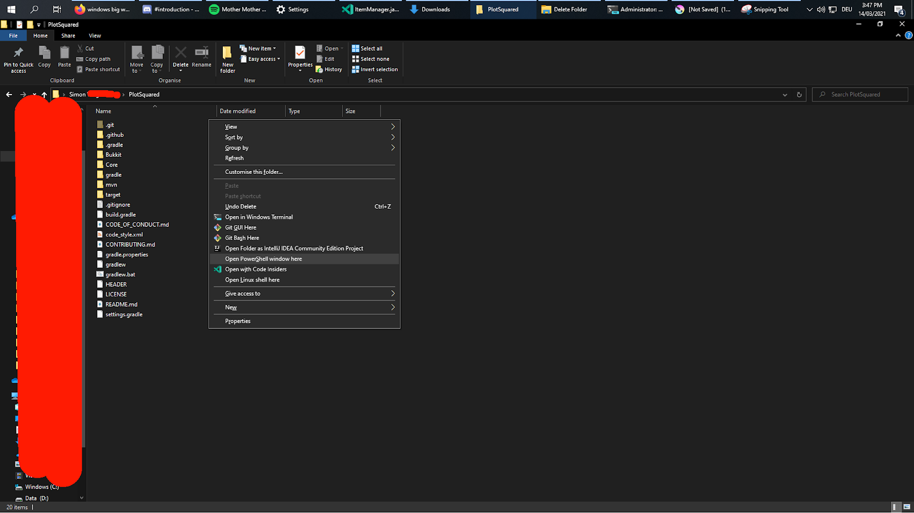
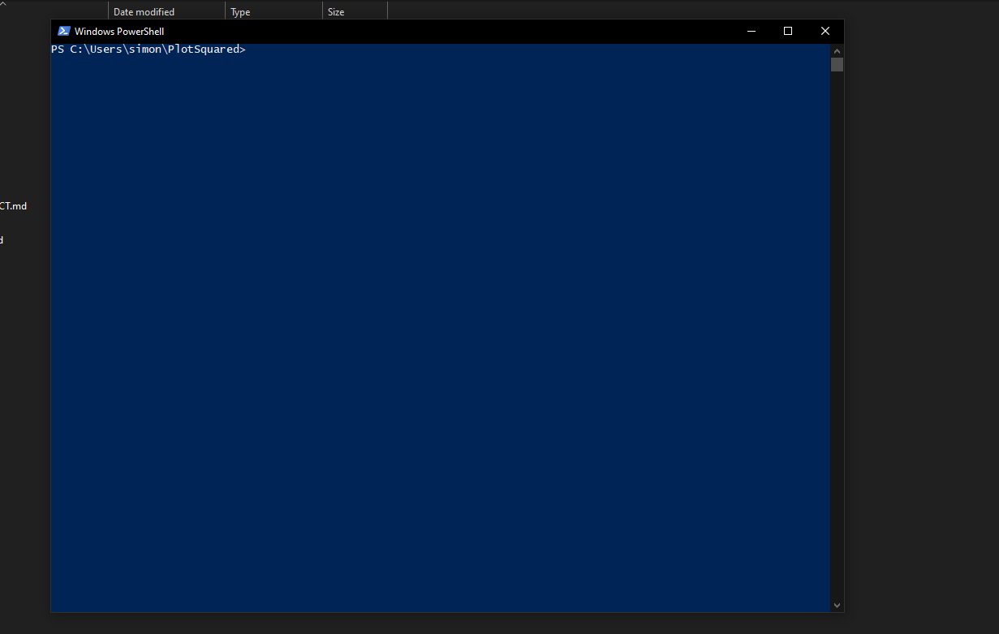

# Plotsquared V6 Compilation

1.  Install a Copy of Java 17 from: [Download](https://adoptopenjdk.net) \

    Setup should be trivial for the most part, just download it, execute it and install it. \

    Note: Make sure you enable the option to “add it to the path” like so:

    .png>)
2. Get a Copy of git if you don’t already have it: [Download](https://git-scm.com/download/win)
3. Get a Copy of PS v5 from GitHub:
4. Download PlotSquared v5 from [GitHub](https://github.com/IntellectualSites/PlotSquared) using some sort of Git Clone. (This is important, the Zip Download will **not** work)
5.  Press “Shift” + Right Click in the the Folder where you copied the PSv5 Source and Press “Open PowerShell Window here”:

    

    This should open a big blue terminal window like the following:

    
6. Enter the Command “.\gradlew build” and press Enter. Wait for it to complete.
7. You should now find a File called “PlotSquared-Bukkit-{some-version-number}.jar” in the “target” folder. This is your compiled version of PSv5 and it should be working perfectly fine!

**DISCLAIMER**: I never used PlotSquared, so please don't request any support from me beyond building the project.
