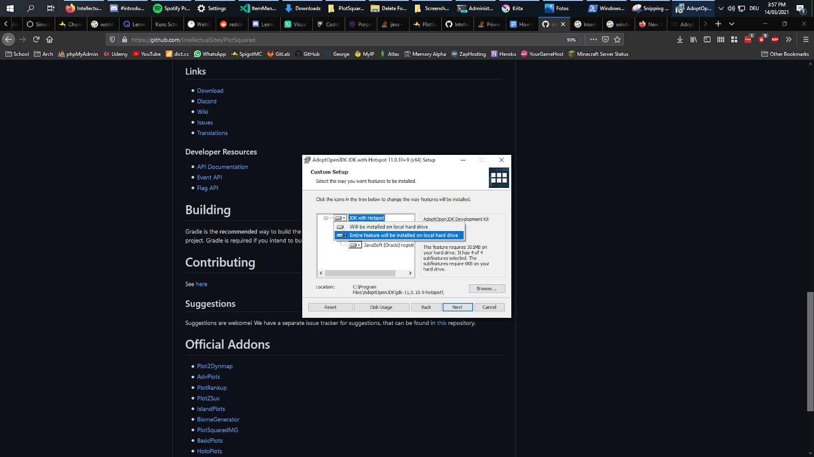

# Plotsquared V6 Compilation

1. Install a Copy of Java 17 from: [Download](https://adoptopenjdk.net/)   

   Setup should be trivial for the most part, just download it, execute it and install it.   

   Note: Make sure you enable the option to “add it to the path” like so:

   

2. Get a Copy of git if you don’t already have it: [Download](https://git-scm.com/download/win)
3. Download PlotSquared v5 from [GitHub](https://github.com/IntellectualSites/PlotSquared) using some sort of recursive Git Clone. \(This is important, the Zip Download will **not** work\)
4. Press Shift + Right Click in the the Folder where you cloned the source code and press “Open PowerShell Window here”: \(You can use **any** terminal emulator for this\) 

   

   This should open a big blue terminal window like the following:

   

5. Enter the Command “.\gradlew build” and press Enter. Wait for it to complete.
6. You should now find a File called “PlotSquared-Bukkit-{some-version-number}.jar” in the “target” folder. This is your compiled version of PSv6 and it should be working perfectly fine!

**DISCLAIMER**: I never used PlotSquared, so please don't request any support from me beyond building the project.

